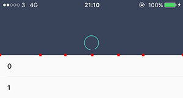
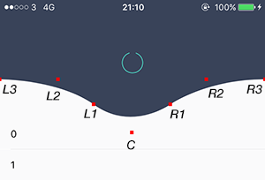
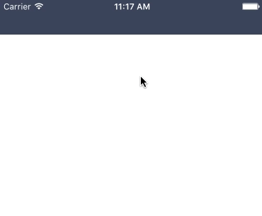
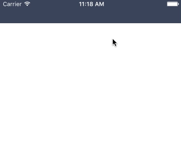
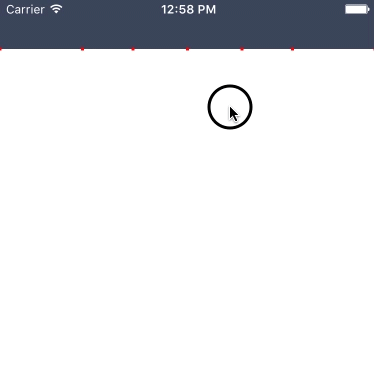
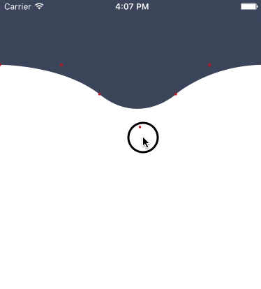
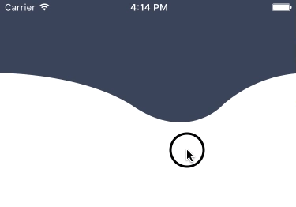

> 原文：[Elastic view animation, or how I built DGElasticPullToRefresh](https://hackernoon.com/elastic-view-animation-or-how-i-built-dgelasticpulltorefresh-269a3ba8636e)
> 原作者 [@gontovnik](https://twitter.com/gontovnik)


[DGElasticPullToRefresh](https://github.com/gontovnik/DGElasticPullToRefresh) 展示了如何实现一个弹性效果。效果如下图所示：


<!-- more -->

开发环境：
Xcode 7
Swift 2.0

要求：
开发者至少对 UIBezierPath 和 UIGestureRecognizer 有一定的了解.

### 理解业务逻辑
你可能从上面的效果图上可以看到一些端倪，这个动画中我们主要使用到了UIBezierPath来实现上面这种效果。
我们首先创建一个贝塞尔曲线路径的CAShapeLayer，然后当你的手指在屏幕上移动的时候我们将移动所有的控制点来呈现动画。每一个控制点会使用一个可见的UIView来表示。下面有几张图来演示它们是如何工作的，我将所有的控制点标识成了红色：






第二章图片中将每个表示控制点的 View 的变量名称标记出来了，如L3，L2等。

当你的手指释放的时候，我们就播放Spring动画，让所有的控制点向其初始位置以一定的回弹效果移动。当所有的视图在动画播放过程中，我们需要时刻计算并我们的贝塞尔曲线（每一帧都进行计算）。因此，我们准备使用CADisplayLink，CADisplayLink在主循环中运行而且每一帧都会去执行指定的方法。

> A CADisplayLink object is a timer object that allows your application to synchronize its drawing to the refresh rate of the display.    - Apple doc

让我们开始Code吧~

----------

### Build

创建一个单视图控制器，然后将下面这些代码粘贴到viewController.swift文件的类声明中。

```
// MARK: -
// MARK: Vars

private let minimalHeight: CGFloat = 50.0  
private let shapeLayer = CAShapeLayer()

// MARK: -

override func loadView() {  
    super.loadView()

    shapeLayer.frame = CGRect(x: 0.0, y: 0.0, width: view.bounds.width, height: minimalHeight)
    shapeLayer.backgroundColor = UIColor(red: 57/255.0, green: 67/255.0, blue: 89/255.0, alpha: 1.0).CGColor
    view.layer.addSublayer(shapeLayer)

    view.addGestureRecognizer(UIPanGestureRecognizer(target: self, action: "panGestureDidMove:"))
}

// MARK: -
// MARK: Methods

func panGestureDidMove(gesture: UIPanGestureRecognizer) {  
    if gesture.state == .Ended || gesture.state == .Failed || gesture.state == .Cancelled {

    } else {
        shapeLayer.frame.size.height = minimalHeight + max(gesture.translationInView(view).y, 0)
    }
}

override func preferredStatusBarStyle() -> UIStatusBarStyle {  
    return .LightContent
}
```

以上代码中，我们做的工作主要有以下几点：
1. 声明了两个变量：shapeLayer 和 minimalHeight。前者是用来表示贝塞尔曲线的，后者是用来定义shapeLayer最小的高度值；
2. 将shapeLayer添加到view的layer中；
3. 添加了一个pan手势到view中，并为该手势添加panGestureDidMove目标方法，当手指移动的时候就会被调用，我们在该方法中修改shapeLayer的高度；
4. 重写父类的preferredStatusBarStyle方法来确保我们的UI更美观一些。

然后编译你的程序，确保实现了以下效果：




每件事情都在按着我们期待的呈现，不过有一点瑕疵。那就是shapeLayer的高度变化有一定的延迟（动画），那是因为隐式动画的原因。我们确定不需要这样的动画，因此在将shapeLayer添加到view的sublayers中之前禁用该layer关于position、bounds以及path的隐式动画。

```
shapeLayer.actions = ["position" : NSNull(), "bounds" : NSNull(), "path" : NSNull()]  
```
然后再次运行，会看到延迟的动画效果没有了。





接下来，我们就需要将最开始所说的那些控制点（L3, L2, L1, C, R1, R2, R3）加入到程序里，然后加入必要的逻辑。

让我们一步一步来：

- 首先，声明一个maxWaveHeight变量，定义这个变量的原因仅仅是希望让我们最终的效果好看一些而已。如果你不指定这个最大值，最终的效果会看起来很丑的；
```
private let maxWaveHeight: CGFloat = 100.0  
```

- 为我们的控制点视图声明变量；

```
private let l3ControlPointView = UIView()  
private let l2ControlPointView = UIView()  
private let l1ControlPointView = UIView()  
private let cControlPointView = UIView()  
private let r1ControlPointView = UIView()  
private let r2ControlPointView = UIView()  
private let r3ControlPointView = UIView()  
```

- 将上面定义的控制点视图设置为3*3的size，然后背景色设置为红色（这里我们只是暂时希望能够更方便演示，最终完成的时候会让它们不可见的），然后将这些控制点添加到View子视图中。将下面这些代码拷贝到loadView方法的尾部；

```
l3ControlPointView.frame = CGRect(x: 0.0, y: 0.0, width: 3.0, height: 3.0)  
l2ControlPointView.frame = CGRect(x: 0.0, y: 0.0, width: 3.0, height: 3.0)  
l1ControlPointView.frame = CGRect(x: 0.0, y: 0.0, width: 3.0, height: 3.0)  
cControlPointView.frame = CGRect(x: 0.0, y: 0.0, width: 3.0, height: 3.0)  
r1ControlPointView.frame = CGRect(x: 0.0, y: 0.0, width: 3.0, height: 3.0)  
r2ControlPointView.frame = CGRect(x: 0.0, y: 0.0, width: 3.0, height: 3.0)  
r3ControlPointView.frame = CGRect(x: 0.0, y: 0.0, width: 3.0, height: 3.0)

l3ControlPointView.backgroundColor = .redColor()  
l2ControlPointView.backgroundColor = .redColor()  
l1ControlPointView.backgroundColor = .redColor()  
cControlPointView.backgroundColor = .redColor()  
r1ControlPointView.backgroundColor = .redColor()  
r2ControlPointView.backgroundColor = .redColor()  
r3ControlPointView.backgroundColor = .redColor()

view.addSubview(l3ControlPointView)  
view.addSubview(l2ControlPointView)  
view.addSubview(l1ControlPointView)  
view.addSubview(cControlPointView)  
view.addSubview(r1ControlPointView)  
view.addSubview(r2ControlPointView)  
view.addSubview(r3ControlPointView)  
```

- 创建一个UIView的扩展，将其放到ViewController的声明上方；

```
extension UIView {  
    func dg_center(usePresentationLayerIfPossible: Bool) -> CGPoint {
        if usePresentationLayerIfPossible, let presentationLayer = layer.presentationLayer() as? CALayer {
            return presentationLayer.position
        }
        return center
    }
}
```

- 当UIView从一帧到另外一帧进行动画的时候，你会试图去取得UIView.frame，而UIView.center会提供给你动画最终的值而不是每一帧的过渡值。因此我们需要定义一个扩展方法提供给我们UIView.layer.presentationLayer的实时位置；
>  presentationLayer的详细信息可以在[官方文档](https://developer.apple.com/library/ios/documentation/GraphicsImaging/Reference/CALayer_class/#//apple_ref/occ/instm/CALayer/presentationLayer) 中查看

- 声明一个currentPath()方法；

```
private func currentPath() -> CGPath {  
    let width = view.bounds.width

    let bezierPath = UIBezierPath()

    bezierPath.moveToPoint(CGPoint(x: 0.0, y: 0.0))
    bezierPath.addLineToPoint(CGPoint(x: 0.0, y: l3ControlPointView.dg_center(false).y))
    bezierPath.addCurveToPoint(l1ControlPointView.dg_center(false), controlPoint1: l3ControlPointView.dg_center(false), controlPoint2: l2ControlPointView.dg_center(false))
    bezierPath.addCurveToPoint(r1ControlPointView.dg_center(false), controlPoint1: cControlPointView.dg_center(false), controlPoint2: r1ControlPointView.dg_center(false))
    bezierPath.addCurveToPoint(r3ControlPointView.dg_center(false), controlPoint1: r1ControlPointView.dg_center(false), controlPoint2: r2ControlPointView.dg_center(false))
    bezierPath.addLineToPoint(CGPoint(x: width, y: 0.0))

    bezierPath.closePath()

    return bezierPath.CGPath
}
```

这个方法返回shapeLayer当前的CGPath。它用到了我们前面所定义和讨论的控制点。

- 声明updateShapeLayer方法；

```
func updateShapeLayer() {  
    shapeLayer.path = currentPath()
}
```
This function will be called when we need shapeLayer to be updated. It is not a private func because we are going to use Selector() for CADisplayLink.

这个方法会在shapeLayer需要更新的时候调用。
- 声明layoutControlPoints方法；

```
private func layoutControlPoints(baseHeight baseHeight: CGFloat, waveHeight: CGFloat, locationX: CGFloat) {  
    let width = view.bounds.width

    let minLeftX = min((locationX - width / 2.0) * 0.28, 0.0)
    let maxRightX = max(width + (locationX - width / 2.0) * 0.28, width)

    let leftPartWidth = locationX - minLeftX
    let rightPartWidth = maxRightX - locationX

    l3ControlPointView.center = CGPoint(x: minLeftX, y: baseHeight)
    l2ControlPointView.center = CGPoint(x: minLeftX + leftPartWidth * 0.44, y: baseHeight)
    l1ControlPointView.center = CGPoint(x: minLeftX + leftPartWidth * 0.71, y: baseHeight + waveHeight * 0.64)
    cControlPointView.center = CGPoint(x: locationX , y: baseHeight + waveHeight * 1.36)
    r1ControlPointView.center = CGPoint(x: maxRightX - rightPartWidth * 0.71, y: baseHeight + waveHeight * 0.64)
    r2ControlPointView.center = CGPoint(x: maxRightX - (rightPartWidth * 0.44), y: baseHeight)
    r3ControlPointView.center = CGPoint(x: maxRightX, y: baseHeight)
}
```

这一部分可能需要解释下这些变量的职责：

1. baseHeight - base的高度。  baseHeight + waveHeight = 我们所需要的总高度；
2. waveHeight - 曲线的波浪高度，我们前面的maxWaveHeight为其设定一个最大值；
3. locationX - 手指在视图中的位置的X坐标
4. width - 显而易见，我们视图的宽度；
5. minLeftX - 定义l3ControlPointView的坐标X值的最小值，这个值可以是负值；
6. maxRightX - 和minLeftX类似，定义r3ControlPointView的坐标X值的最大值；
7. leftPartWidth - 定义 minLeftX 和 locationX之间的距离；
8. rightPartWidth -  定义 locationX 和 maxRightX之间的距离；

你可能会问，为什么我们要使用这些值来设定我们的控制点呢？答案很简单，我使用了PaintCode，然后内部建立贝塞尔曲线，不断的试直到令我满意
的效果时，我就将这些值替换到程序中即可。

- 更新我们的panGestureDidMove方法，这样当我们手指移动的时候所有的控制点也能移动。用以下的代码替换panGestureDidMove方法中的内容；

```
func panGestureDidMove(gesture: UIPanGestureRecognizer) {  
    if gesture.state == .Ended || gesture.state == .Failed || gesture.state == .Cancelled {

    } else {
        let additionalHeight = max(gesture.translationInView(view).y, 0)

        let waveHeight = min(additionalHeight * 0.6, maxWaveHeight)
        let baseHeight = minimalHeight + additionalHeight - waveHeight

        let locationX = gesture.locationInView(gesture.view).x

        layoutControlPoints(baseHeight: baseHeight, waveHeight: waveHeight, locationX: locationX)
        updateShapeLayer()
    }
}
```

我们所做的就是计算wave高度，基础高度以及手指的位置，然后调用layoutControlPoints去布局各个控制点，然后调用updateShapeLayer来更新我们的shapeLayer的path。

What we do is calculate wave height, base height, location of the finger and call our function: layoutControlPoints to layout control points and updateShapeLayer to update our shape layer path.

- 在loadView方法尾部添加两行代码，使得我们在打开app的时候正确的显示；

```
layoutControlPoints(baseHeight: minimalHeight, waveHeight: 0.0, locationX: view.bounds.width / 2.0)  
updateShapeLayer()  
```

- 修改
```
shapeLayer.backgroundColor = UIColor(red: 57/255.0, green: 67/255.0, blue: 89/255.0, alpha: 1.0).CGColor  
```
为

```
shapeLayer.fillColor = UIColor(red: 57/255.0, green: 67/255.0, blue: 89/255.0, alpha: 1.0).CGColor  
```


到这里，效果应该如下所示：




最后一件要做的事情就是，把我们释放手指之后的回弹动画整合进去。
还是让我们一步一步来吧：

- 定义displayLink变量；

```
private var displayLink: CADisplayLink!
```

在loadView方法的末尾进行初始化：

```
displayLink = CADisplayLink(target: self, selector: Selector("updateShapeLayer"))  
        displayLink.addToRunLoop(NSRunLoop.mainRunLoop(), forMode: NSDefaultRunLoopMode)
        displayLink.paused = true
```

前面我们也提到过，我们的CADisplayLink对象会在每一帧都调用指定的方法（这里就是指定的updateShapeLayer），因此我们就可以在UIView的动画期间实时的更新shapeLayer的path了。

- 定义animating变量；

```
private var animating = false {  
    didSet {
        view.userInteractionEnabled = !animating
        displayLink.paused = !animating
    }
}
```

这个可以控制用户交互是否开启以及displayLink的停止和播放（动画播放期间你肯定不希望用户的交互直接就把动画效果给破坏了。）

```
private func currentPath() -> CGPath {  
    let width = view.bounds.width

    let bezierPath = UIBezierPath()

    bezierPath.moveToPoint(CGPoint(x: 0.0, y: 0.0))
    bezierPath.addLineToPoint(CGPoint(x: 0.0, y: l3ControlPointView.dg_center(animating).y))
    bezierPath.addCurveToPoint(l1ControlPointView.dg_center(animating), controlPoint1: l3ControlPointView.dg_center(animating), controlPoint2: l2ControlPointView.dg_center(animating))
    bezierPath.addCurveToPoint(r1ControlPointView.dg_center(animating), controlPoint1: cControlPointView.dg_center(animating), controlPoint2: r1ControlPointView.dg_center(animating))
    bezierPath.addCurveToPoint(r3ControlPointView.dg_center(animating), controlPoint1: r1ControlPointView.dg_center(animating), controlPoint2: r2ControlPointView.dg_center(animating))
    bezierPath.addLineToPoint(CGPoint(x: width, y: 0.0))

    bezierPath.closePath()

    return bezierPath.CGPath
}
```

更新currentPath方法，将dg_center方法参数换为animating参数仅当动画需要的时候才提供layer的准确过渡值。

- 最后一步就是需要更新panGestureDidMove方法中的if判断语句；

```
if gesture.state == .Ended || gesture.state == .Failed || gesture.state == .Cancelled {  
    let centerY = minimalHeight

    animating = true
    UIView.animateWithDuration(0.9, delay: 0.0, usingSpringWithDamping: 0.57, initialSpringVelocity: 0.0, options: [], animations: { () -> Void in
        self.l3ControlPointView.center.y = centerY
        self.l2ControlPointView.center.y = centerY
        self.l1ControlPointView.center.y = centerY
        self.cControlPointView.center.y = centerY
        self.r1ControlPointView.center.y = centerY
        self.r2ControlPointView.center.y = centerY
        self.r3ControlPointView.center.y = centerY
        }, completion: { _ in
            self.animating = false
    })
} else {
    let additionalHeight = max(gesture.translationInView(view).y, 0)

    let waveHeight = min(additionalHeight * 0.6, maxWaveHeight)
    let baseHeight = minimalHeight + additionalHeight - waveHeight

    let locationX = gesture.locationInView(gesture.view).x

    layoutControlPoints(baseHeight: baseHeight, waveHeight: waveHeight, locationX: locationX)
    updateShapeLayer()
}
```

我们已经为UIView添加了Sprint动画，让我们的控制点能够通过很优雅的回弹效果回到它们的位置。你可以修改以上的变量值来使你的动画看起来更优美，更好看。

让我们在设备上运行下看看能够让你震惊的效果：




当然，我们可能不太想显示这些红色的点。你可以在loadView方法中移除那些设置这些控制点的frame 以及背景色的代码。

再次运行代码效果如下：




效果很完美，但是，在这个例子中我们还有一件事情没做，就是没有改变 shapeLayer 的高度，我们仅仅修改了 path 的高度。这个不够完美，需要修复它。我想这个对于你来说应该是不错的练习。尽情修改frame、path以及所有变量的值吧！


> 这个Demo的源码在[这里](https://github.com/gontovnik/DGElasticBounceTutorial)
> [DGElasticPullToRefresh](https://github.com/gontovnik/DGElasticPullToRefresh)的源码在这里


